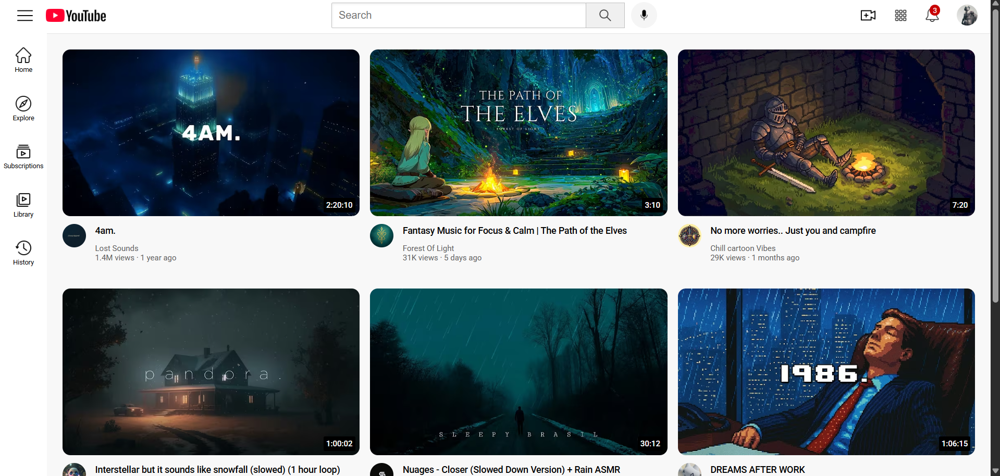

# 📺 YouTube Clone  

A clean and minimal **YouTube Clone UI** built using **HTML & CSS**, styled to closely resemble the official YouTube layout.  
This project is focused on practicing **frontend fundamentals**, **UI/UX replication**, and **modern styling techniques**.  



---

## ✨ Features  

- 🎨 **Responsive Design** – Layout adjusts neatly for different screen sizes.  
- 🧭 **Sidebar Navigation** – Home, Explore, Subscriptions, Library, History.  
- 🔍 **Search Bar UI** – Styled with tooltip-enabled buttons.  
- 🎬 **Video Grid** – YouTube-like video preview cards with thumbnails, titles, and metadata.  
- 🔔 **Header Icons** – Upload, Notifications, and User Profile section.  
- 🖼️ **Custom Icons** – Icons sourced from [Flaticon](https://www.flaticon.com/) for a polished look.  

---

## 🛠 Tech Stack  

| Tool    | Purpose               |
|---------|-----------------------|
| HTML5   | Structure & Semantics |
| CSS3    | Styling & Layout      |
| Flaticon Images | Custom Icons   |

---

## 🚀 Getting Started  

Clone this repo and open in your browser:

```bash
# Clone the repository
git clone https://github.com/<your-username>/Youtube-Clone.git

# Navigate into the project folder
cd Youtube-Clone

# Open the index.html in browser

